# Hi there 👋

I'm **Julien Maitrehenry**, a Backend/Go developer, DevOps Engineer and Docker Captain. I have a passion for cloud computing, containers, and automation. Currently, I'm working as Chief Architect at Paren.

## 🔧 Technologies & Tools

- **Languages**: Go
- **Tools**: Docker, Kubernetes, ansible, terraform
- **Cloud**: AWS, Azure, Digital Ocean, OVH Cloud, Google Cloud
- **Databases**: MySQL, MariaDB, Redis/ValKey, Opensearch

## 💬 Ask Me About

- Docker and containerization
- DevOps practices and tools
- Cloud computing
- Go
- Distributed system

## 📫 How to Reach Me

- GitHub: [jmaitrehenry](https://github.com/jmaitrehenry)
- LinkedIn: [Julien Maitrehenry](https://linkedin.com/in/jmaitrehenry)
- Website: [Julien Maitrehenry](https://www.jmaitrehenry.ca)
- Speakerdeck: [jmaitrehenry](https://speakerdeck.com/jmaitrehenry)

## ⚡ Fun Fact

I love exploring new technologies and sharing my knowledge with the community. When I'm not coding, you can find me shooting (archery), reading, playing video games or traveling.

---

Feel free to explore my repositories and reach out if you have any questions or collaboration ideas!
